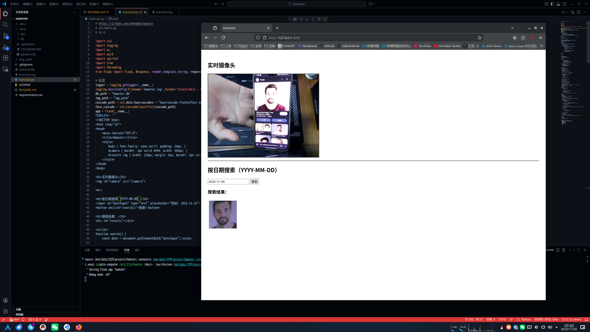

# Hamster

## 这是什么？
这是一个人脸识别程序，并将识别到的图片存储起来，同时记录到数据库中。它还有web页面，可以显示摄像头的实时画面，以及按照日期搜索图片。
## 安装并使用
首先请确保你安装了[Python3.x](https://www.python.org/downloads/release/python-3128/)，然后安装依赖：
```shell
pip install -r requirements.txt
```
[下载本项目](https://github.com/xhdndmm/hamster/releases)然后运行`hamster.py`既可
```shell
python hamster.py
```
## 技术说明
本程序使用opencv作为视频处理，调用其自带的人脸识别模块，在识别到人脸后存储照片为uuid的命名，再存储时间和命名到sqlite数据库中。web页面显示实时画面，搜索功能直接在数据库中搜素，并返回图片。
## 问题反馈
如果你在使用中遇到问题，请在[这里](https://github.com/xhdndmm/hamster/issues)反馈
## 使用协议
本程序使用[MIT许可证](./LICENSE)